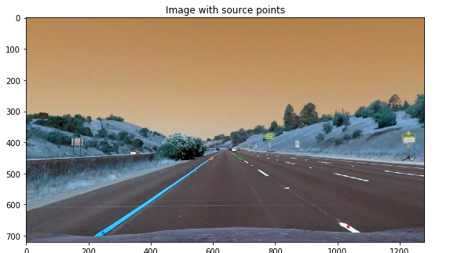

## Writeup Template

### You can use this file as a template for your writeup if you want to submit it as a markdown file, but feel free to use some other method and submit a pdf if you prefer.

---

**Advanced Lane Finding Project**

The goals / steps of this project are the following:

* Compute the camera calibration matrix and distortion coefficients given a set of chessboard images.
* Apply a distortion correction to raw images.
* Use color transforms, gradients, etc., to create a thresholded binary image.
* Apply a perspective transform to rectify binary image ("birds-eye view").
* Detect lane pixels and fit to find the lane boundary.
* Determine the curvature of the lane and vehicle position with respect to center.
* Warp the detected lane boundaries back onto the original image.
* Output visual display of the lane boundaries and numerical estimation of lane curvature and vehicle position.

## [Rubric](https://review.udacity.com/#!/rubrics/571/view) Points

### Here I will consider the rubric points individually and describe how I addressed each point in my implementation.  

### Camera Calibration

#### 1. Briefly state how you computed the camera matrix and distortion coefficients. Provide an example of a distortion corrected calibration image.

The code for this step is contained in the first code cell of the IPython notebook located in "./P2.ipynb".

I start by preparing "object points", which will be the (x, y, z) coordinates of the chessboard corners in the world. Here I am assuming the chessboard is fixed on the (x, y) plane at z=0, such that the object points are the same for each calibration image.  Thus, `objp` is just a replicated array of coordinates, and `objpoints` will be appended with a copy of it every time I successfully detect all chessboard corners in a test image.  `imgpoints` will be appended with the (x, y) pixel position of each of the corners in the image plane with each successful chessboard detection.  

I then used the output `objpoints` and `imgpoints` to compute the camera calibration and distortion coefficients using the `cv2.calibrateCamera()` function.  I applied this distortion correction to the test image using the `cv2.undistort()` function and obtained this result: 


### Pipeline (single images)

#### 1. Provide an example of a distortion-corrected image.

To demonstrate this step, I will describe how I apply the distortion correction to one of the test images like this one:


#### 2. Describe how (and identify where in your code) you used color transforms, gradients or other methods to create a thresholded binary image.  Provide an example of a binary image result.

I used a combination of color and gradient thresholds to generate a binary image (thresholding steps in the second code cell of the IPython notebook).  Here's an example of my output for this step.


#### 3. Describe how (and identify where in your code) you performed a perspective transform and provide an example of a transformed image.

The code for my perspective transform includes a function called `undistort_transform()`, which appears in the 3rd code cell of the IPython notebook.  The `undistort_transform()` function takes as inputs an image (`img`) and hardcorded the source (`src`) and destination (`dst`) points. I chose the hardcode the source and destination points in the following manner:

```python
src = np.float32(
    [
        [246,690],
        [594,450],
        [685,450],
        [1035,670]
    ])
    dst = np.float32(
    [
        [(img.shape[1]-700)//2,img.shape[0]],
        [(img.shape[1]-700)//2,0],
        [img.shape[1]-(img.shape[1]-700)//2,0],
        [img.shape[1]-(img.shape[1]-700)//2,img.shape[0]]
    ])
```

This resulted in the following source and destination points:

| Source       | Destination   | 
|:-------------:|:-------------:  | 
| 246, 69      | 290, 720      | 
| 594, 450     | 290, 0      |
| 685, 450     | 990, 0      |
| 1035, 670    | 990, 0      |

I verified that my perspective transform was working as expected by drawing the `src` and `dst` points onto a test image and its warped counterpart to verify that the lines appear parallel in the warped image.


#### 4. Describe how (and identify where in your code) you identified lane-line pixels and fit their positions with a polynomial?

Then I did some other stuff and fit my lane lines with a 2nd order polynomial kinda like this:


#### 5. Describe how (and identify where in your code) you calculated the radius of curvature of the lane and the position of the vehicle with respect to center.

I did this with functions defined in the fourth code cell of the IPython notebook.

#### 6. Provide an example image of your result plotted back down onto the road such that the lane area is identified clearly.

I implemented this step in the fifth code cell of the IPython notebookin the function `pipeline_img()`.  Here is an example of my result on a test image:


---

### Pipeline (video)

#### 1. Provide a link to your final video output.  Your pipeline should perform reasonably well on the entire project video (wobbly lines are ok but no catastrophic failures that would cause the car to drive off the road!).

Here's this directory for my video result: ./output_images/FinalProcessedVideo.mp4

---

### Discussion

#### 1. Briefly discuss any problems / issues you faced in your implementation of this project.  Where will your pipeline likely fail?  What could you do to make it more robust?

Here I'll talk about the approach I took, what techniques I used, what worked and why, where the pipeline might fail and how I might improve it if I were going to pursue this project further.  

The camera calibration went well with no problem. However, I was a little confused that if the matrix and distortion coeffieicnt from camera calibration could be directly used for the test images and videos. I assumed yes if they were taken by the same camera.

The pipeline was very difficult for me. I managed to create the binary image based on x gradient and saturation from HLS channels, as they were the most significant two channels that identifies the lane lines. Similarly, the perspective transform went well, too.

However, when I started to fit the polynomial equation, things start to mess up. I ended up with a combined equation with both "sliding window" and "from prior" to fit the polynomial equation. This works but definitely creates problem when I want to apply the sanity check.

The radius of curvature of the lane and the position of the vehicle with respect to center are calculated smoothly. But as mentioned, I was not able to fully implement the Sanity Check, Look-Ahead Filter, and Smoothing steps, the results were just Okay for the selected video. The pipeline is likely to fail when there are large shadows on the lanelines. This can be improved by specifically use the shadowed laneline image as test image to explore the possible combination of color and gradient combinations to create thresholded binary images. In addition, I believe if I could put more time on this project and clean up the logistic of the code, I could get better and more stable lane identification results.
